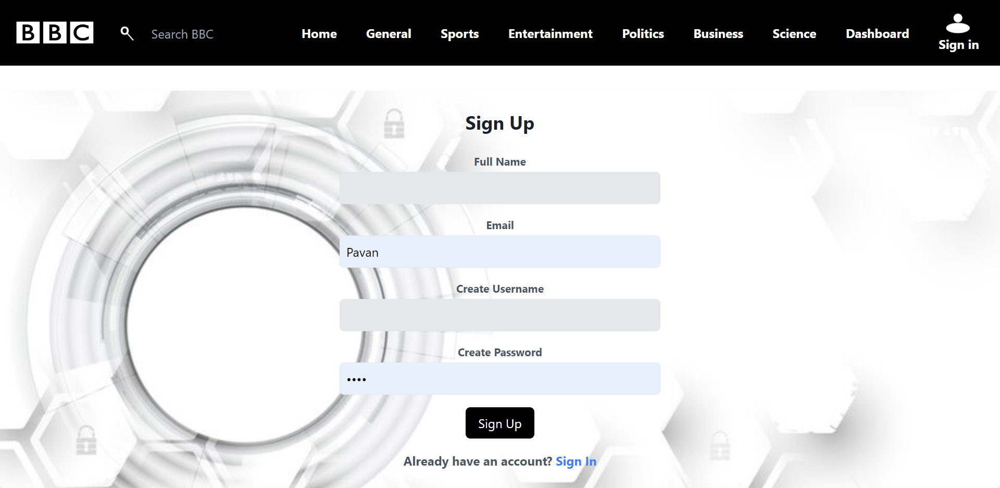
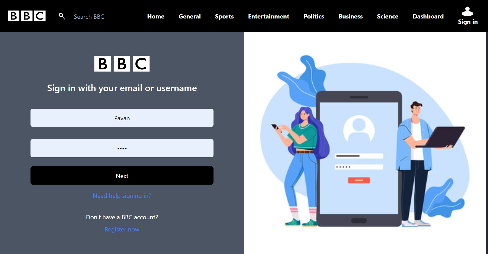
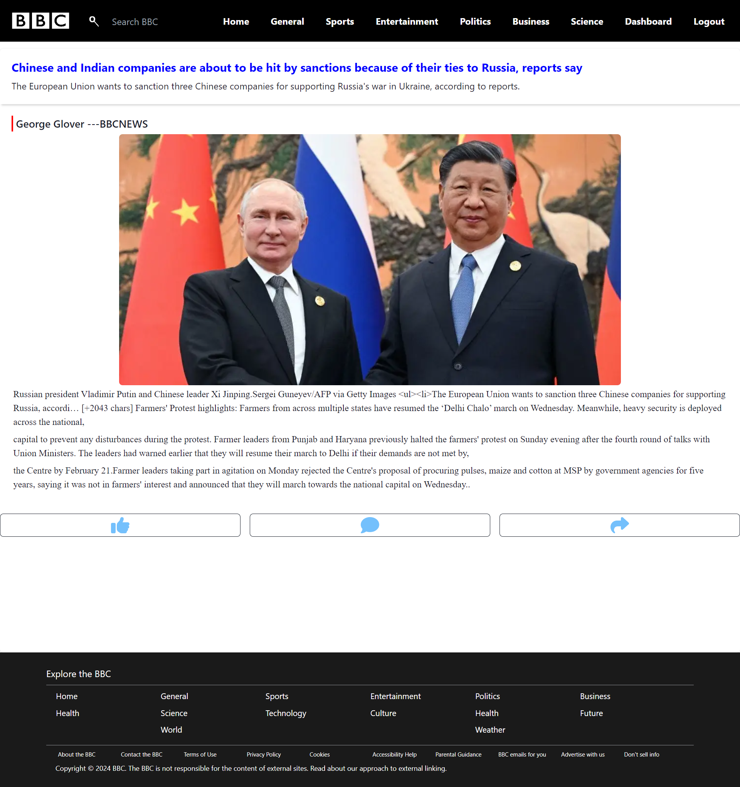
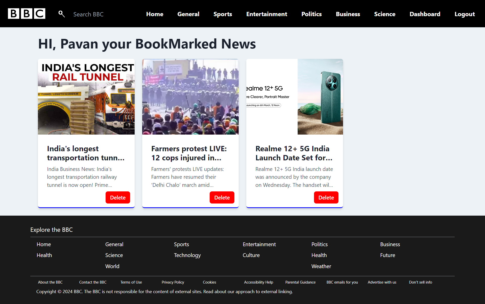

# BBC News Clone

## Introduction
Welcome to the BBC News Clone project, developed and maintained by Saurabh Ganguly. This project is a solo endeavor aimed at replicating the functionality and design of the renowned BBC News website, offering users a platform to access reliable and up-to-date news content.

## Project Overview
The BBC News Clone project mirrors the user experience of BBC News, providing diverse news categories, in-depth articles, multimedia content, and intuitive navigation.

## Features
- **Comprehensive News Categories:** Explore a wide array of news categories, including world news, politics, business, technology, science, health, and more.
- **Responsive Design:** Enjoy a seamless news browsing experience across various devices, thanks to a responsive and user-friendly design.
- **Latest Updates:** Stay informed with constantly updated news feeds and breaking news alerts.
- **Multimedia Experience:** Dive into rich multimedia content accompanying news articles for a comprehensive understanding.
- **Efficient Search:** Easily find specific news topics or articles with the built-in search functionality.
- **User Authentication:** Personalize your news feed and engage with the community through comments and discussions.
- **Accessibility:** Prioritize accessibility standards, ensuring inclusivity for all users.

## Technologies Used
- **Frontend:** React || JavaScript || Redux || Chakra UI || HTML5 || CSS3 || Tailwind CSS 
- **Backend:** Node.js
- **Database:** MongoDB
- **Deployment:** Vercel || Render

## Screenshots:

### SignupPage/RegisterPage

### SignInPage

### HomePage

### GeneralPage

### SigleNewsPage

### BookmarkPage

## Credentials:

To access authenticated pages, you can use the following credentials:

{
  "username": "user",
  "password": "1234"
},